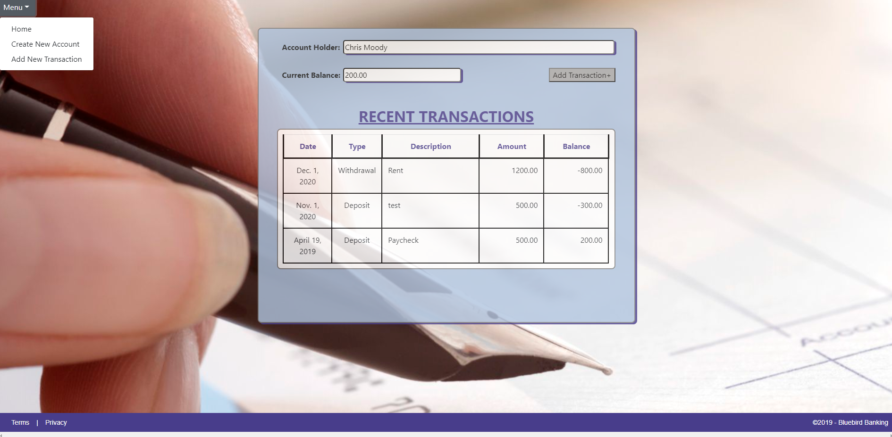

# BlueBird Banking
 
 Personal checkbook application that allows users track their their transactions across multiple accounts
 
  Technologies used in creation:
 - Python
 - HTML
 - CSS
 - Django
 
 
 
  ## Table of Contents
 * [Setting up the Environment](/README.md#setting-up-the-environment)
 * [Checkbook Templates, Static files, and URLs](/README.md#geometry-manager)
 * [Models](/README.md#models)
 * [Creating Accounts and Transactions](/README.md#creating-accounts-and-transactions)
 * [Account Balance/Transaction information](/README.md#closing-thoughts)
 
## Setting up the Environment
I began by setting up a virtual environment. I then installed Django and all the necessary modules. 
After making sure my environment was set up correctly I created the project and and app within called "Checkbook".

## Checkbook Templates, Static files, and URLs
This task included creating the base template and all the necessary inherited templates. After this I added the provided CSS styling and images files.
During this step URL routing and view function for the base.html file was completed as well.

## Models
For this project I used two models. One for accounts data and another for transactions data. Within these I established a "one to many" relationship for the account field to tie the models together.

## Creating Accounts and Transactions
To implement create functionality, I added seperate view functions for both the Accounts and Transaction models.

## Account Balance/Transaction information
Lastly I added a read function that allows the user to see balance/transaction information from any of their accounts.

